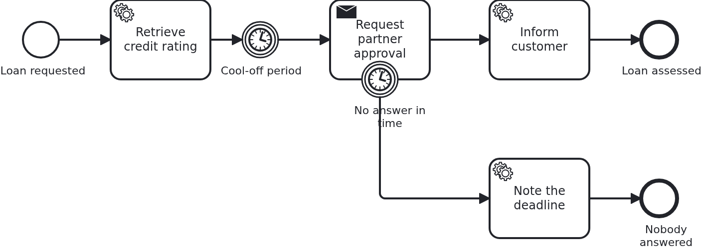

# Timers

[](./LICENSE)

Waiting is part of most business processes: a cool-off period before something is sent, a
deadline after which a request is chased or dropped. A BPMS does that waiting for you, and
this blueprint shows both shapes of it - one that delays the process, and one that takes
work away.

## What this blueprint shows



The loan approval of the base blueprint, with a partner who has to approve the loan and two
timers around that:

- **A timer in the sequence flow.** After the rating the workflow simply waits, and only
  then is the partner asked. Nothing of the application runs meanwhile: no thread, no
  scheduler, no `sleep`. The BPMS holds the instance and wakes it up.
- **A deadline on the waiting task.** The task that asks the partner carries an
  interrupting timer boundary event. If no answer arrives in time, the workflow leaves the
  task and takes the path behind the timer, where the process decides what a missed
  deadline means.

The second one is where the application notices something: an interrupting boundary event
cancels the open task, and the handler is called once more with `@TaskEvent CANCELED` so it
can drop the task id it kept. **Not every BPMS reports that**, so an application must not
depend on it for correctness - answering a task that is gone is a no-op either way. Which
engines deliver cancellations is on
[the adapter's wiki page](https://github.com/vanillabp/adapter-platform-integration/wiki/BPMS-adapters),
and the test of this blueprint asserts the cleared id only where it is delivered.

The durations live in the model (`PT1S` and `PT3S` here), which is a decision, not a
detail: a timer belongs to the process, so changing it is a new process version with
instances still running on the old one. A deadline that belongs to a contract or a customer
is better read from the aggregate - both Camunda engines support an expression instead of a
literal.

## Delta to the base blueprint

Compared to [`module-single`](https://github.com/vanillabp-blueprints/module-single-springboot):

|            File            |                                  What is different                                  |
|----------------------------|-------------------------------------------------------------------------------------|
| `loan_approval.bpmn`       | a timer catch event, a task waiting for a partner, and a timer boundary event on it |
| `WorkflowTaskHandler.java` | the `@WorkflowTask` method of the waiting task, taking `@TaskId` and `@TaskEvent`   |
| `Workflow.java`            | `completeTask` in addition to `startWorkflow`                                       |
| `Service.java`             | sends the request, keeps the task id, answers it, and notes a missed deadline       |
| `Aggregate.java`           | `partnerApprovalTaskId`, `partnerApproved` and `timedOut`                           |
| `LoanApprovalIT.java`      | one test per outcome: answered in time, and not answered at all                     |
| `pom.xml`                  | hands the BPMS of the build to the tests, for the assertion about cancellations     |

## Running it

Requires a JDK 21. Camunda 7 is embedded, so nothing else has to run:

```bash
mvn install verify
```

Running it on another BPMS is a Maven profile, not one line of Java changes:

```bash
mvn install verify -Pcamunda8
```

Camunda 8 is a remote engine, so a cluster has to run. Start one; its address, and everything
else specific to that engine, lives in its profile file
`application/src/main/resources/application-camunda8.yaml`, with a copy for the module's own
test:

```yaml
vanillabp:
  adapters:
    camunda8:
      # Camunda 8 is a remote engine: point this at your cluster.
      rest-address: http://localhost:8080
```

That file is loaded because the Maven profile `camunda8` sets the Spring profile of the same
name, so the engine is chosen once, on the Maven command line, and the build, the tests and
`spring-boot:run` all follow it.

Start the application:

```bash
mvn -pl application spring-boot:run
```

Nothing about identifiers shows up at startup: the BPMS profiles of this blueprint set
`name-clash-avoidance: use-prefix`, so VanillaBP puts the workflow module ID in front of every
identifier before it reaches the engine and takes it off again on the way back. The BPMN files,
the business code and the rest of the configuration keep the plain names, and no tenant is
involved, which matters on a BPMS licensed per tenant. What the modes are and what each of them
costs is in
[the wiki](https://github.com/vanillabp/adapter-platform-integration/wiki/Workflow-modules#how-name-clashes-are-avoided).

Start a loan approval. This is the only URL you need:

```
http://localhost:8080/api/loan-approval/start?amount=5000
```

The rating is done at once, the partner is asked a second later, and from then on the clock
runs:

```
Loan approval '0f7c…' started
Credit rating of loan approval '0f7c…' is 50
Partner was asked to approve loan approval '0f7c…' (5000 at a rating of 50)
Loan approval '0f7c…' waits for the partner, but not forever - the task carries a deadline of three seconds:
  Approved -> http://localhost:8080/api/loan-approval/0f7c…/partner-approved/1a2b…
```

Open that URL quickly and the answer is accepted:

```
The partner approved loan approval '0f7c…'
The customer of loan approval '0f7c…' was informed
```

Wait instead, and the deadline ends the wait by itself:

```
The partner request of loan approval '4b21…' was canceled
Nobody answered for loan approval '4b21…' in time
```

The first of those two lines is the cancellation reaching the same handler that sent the
request - on a BPMS that reports cancellations. Opening the URL afterwards answers that this
request is not open any more, which the application decides on its own.

While the application runs on Camunda 7, Camunda's own web applications are served at

```
http://localhost:8080/camunda
```

Log in with `demo` / `demo`. Cockpit is the quickest way to see a timer: the instance sits
at the catch event with the time it will fire. The user comes from
`application/src/main/resources/application-camunda7.yaml` and exists so that the
blueprint can be operated without setting one up; an application with an identity provider
of its own leaves that section out.

The Camunda 8 profile brings neither the dependency nor those settings into effect. Its
tooling is part of the cluster, and the file naming a Camunda 7 adapter id is simply not
loaded there - a profile file applies to its own engine and to no other. Naming an adapter
id whose adapter is not on the classpath is a configuration error VanillaBP refuses to
start with, and the profiles are what keeps that from happening.

## How it works

|                                          File                                          |                                              Role                                               |
|----------------------------------------------------------------------------------------|-------------------------------------------------------------------------------------------------|
| `loan-approval/src/main/resources/loan-approval/processes/camunda7/loan_approval.bpmn` | the process: a timer catch event, a waiting task and an interrupting timer boundary event on it |
| `.../loanapproval/WorkflowTaskHandler.java`                                            | the method of the waiting task: `@TaskId` to keep, `@TaskEvent` to hear about the cancellation  |
| `.../loanapproval/Service.java`                                                        | asks the partner once, answers the task, and notes a missed deadline                            |
| `.../loanapproval/Workflow.java`                                                       | `completeTask`, the only place `ProcessService` is used                                         |
| `.../loanapproval/model/Aggregate.java`                                                | the task id, the answer and whether the deadline ran out                                        |
| `loan-approval/src/test/.../LoanApprovalIT.java`                                       | answered in time, and not answered at all                                                       |

Neither timer costs the application anything while it runs. The BPMS persists the due date,
wakes the instance up and delivers the next task - which is the reason to model waiting
instead of building it: a restart, a deployment or a night without traffic changes nothing
about a due date.

The tests wait for the aggregate rather than for a clock. A timer fires when the BPMS gets
to it, so a test that sleeps for exactly three seconds is a test that fails on a slow
machine.

## Documentation

- [Workflow tasks](https://github.com/vanillabp/adapter-platform-integration/wiki/Workflow-tasks#parameters): `@TaskId` and `@TaskEvent`, the two parameters this blueprint needs
- [Completing and canceling asynchronous tasks](https://github.com/vanillabp/adapter-platform-integration/wiki/Workflow-tasks#completing-and-canceling-asynchronous-tasks): the rules the answer follows, and what happens to a task that is gone
- [BPMS adapters](https://github.com/vanillabp/adapter-platform-integration/wiki/BPMS-adapters): which engine reports a cancellation to the application, and which does not
- the wiki of the BPMS adapter you use: how timers are executed, and what an expression instead of a literal duration may read

This blueprint is developed in the monorepo
[`blueprints`](https://github.com/vanillabp-blueprints/blueprints). This repository is a
read-only mirror, **issues and pull requests belong there.**

## Noteworthy & Contributors

[VanillaBP](https://www.github.com/vanillabp/spi-for-java) was developed by [Phactum](https://www.phactum.at) with the
intention of giving back to the community as it has benefited the community in the past.


## License

Copyright 2026 Phactum Softwareentwicklung GmbH

Licensed under the Apache License, Version 2.0
